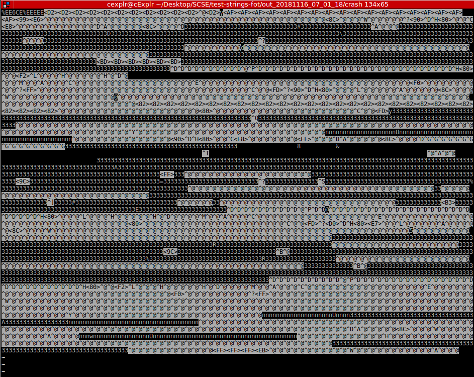

## Crash 2 - [ Malformed Tek Hex file ]

Since it is our choice to choose any crash inputs, I wrote us a short line to view all the types of files. Interestingly, I found some that doesnt look like a file. So lets choose that for our next crash analysis.

```
for i in *; do file $i; sleep 0.5;done
```

and we see

```
.
.
.w01_000113,sig:11,Splice:5:16,src:w01_000877: ELF 32-bit LSB executable, Intel 80386, version 1 (SYSV), statically linked, corrupted section header size
w01_000114,sig:11,Havoc:560:1536,src:w01_000890: ELF 64-bit LSB processor-specific, *unknown arch 0xf9ff* (SYSV)
w01_000115,sig:11,Havoc:18945:24576,src:w01_000890: ELF 64-bit LSB processor-specific, *unknown arch 0xf9ff* (SYSV)
w01_000116,sig:11,Splice:1:24,src:w01_000913: data
w01_000117,sig:11,Havoc:6:736,src:w01_000924: data
w01_000118,sig:11,Havoc:7:736,src:w01_000924: data
w01_000119,sig:11,Havoc:58:5888,src:w01_000924: data
w01_000120,sig:11,Havoc:246:23552,src:w01_000924: data
.
.
.
```
For this lets take a look at data files. I choose `w01_000119,sig:11,Havoc:58:5888,src:w01_000924: data`.
Since this is a data file, we can take a at its content. 



Viewing it on a hex editor should be better.


There seem to contain a lot of repeating characters. It is also certainly not an ELF file because the ELF magic numbers are not present at the first few bytes of the file.

Now we try running as input for strings program.

```
cexplr@cExplr ~/Desktop/test-strings-fot/out_20181116_07_01_18/crash $ ../../strings w01_000119\,sig\:11\,Havoc\:58\:5888\,src\:w01_000924 
Segmentation fault
```

Just a lonely Segmentation Fault is printed out. 

Running it with GDB the same way, we get this

```
[----------------------------------registers-----------------------------------]
RAX: 0x3e9d 
RBX: 0x63 ('c')
RCX: 0x70bae0 --> 0x0 
RDX: 0x70bae0 --> 0x0 
RSI: 0x64 ('d')
RDI: 0x3333333333333333 ('33333333')
RBP: 0x7fffffffda3d ('3' <repeats 20 times>, "\001")
RSP: 0x7fffffffd940 --> 0xcd65 
RIP: 0x40bfd7 (<bfd_alloc+39>:	mov    rdi,QWORD PTR [rdi+0x118])
R8 : 0x3 
R9 : 0x63 ('c')
R10: 0x3333333333333352 ('R3333333')
R11: 0x7ffff7b5aea0 (<__memcpy_avx_unaligned>:	mov    rax,rdi)
R12: 0xfffffffffffffffc 
R13: 0x64 ('d')
R14: 0xfffffffffffffffc 
R15: 0x7fffffffda3b ("3#", '3' <repeats 20 times>, "\001")
EFLAGS: 0x10206 (carry PARITY adjust zero sign trap INTERRUPT direction overflow)
[-------------------------------------code-------------------------------------]
   0x40bfc6 <bfd_alloc+22>:	xor    rax,0x48de
   0x40bfcc <bfd_alloc+28>:	inc    BYTE PTR [rcx+rax*1]
   0x40bfcf <bfd_alloc+31>:	mov    DWORD PTR fs:[r14],0x246f
=> 0x40bfd7 <bfd_alloc+39>:	mov    rdi,QWORD PTR [rdi+0x118]
   0x40bfde <bfd_alloc+46>:	lea    rax,[rsi+0x7]
   0x40bfe2 <bfd_alloc+50>:	and    rax,0xfffffffffffffff8
   0x40bfe6 <bfd_alloc+54>:	test   rsi,rsi
   0x40bfe9 <bfd_alloc+57>:	mov    esi,0x8
[------------------------------------stack-------------------------------------]
0000| 0x7fffffffd940 --> 0xcd65 
0008| 0x7fffffffd948 --> 0x63 ('c')
0016| 0x7fffffffd950 --> 0x71e740 --> 0x71e180 --> 0x0 
0024| 0x7fffffffd958 --> 0x416405 (<tekhex_object_p+4165>:	mov    QWORD PTR [r14+0x8],rax)
0032| 0x7fffffffd960 --> 0x0 
0040| 0x7fffffffd968 --> 0x3645452533000000 ('')
0048| 0x7fffffffd970 ('3' <repeats 20 times>, "\001")
0056| 0x7fffffffd978 ('3' <repeats 12 times>, "\001")
[------------------------------------------------------------------------------]
Legend: code, data, rodata, value
Stopped reason: SIGSEGV
bfd_alloc (abfd=0x3333333333333333, size=0x64) at ../../bfd/opncls.c:652
652	../../bfd/opncls.c: No such file or directory.
gdb-peda$ 

```

Here we have an error at btf_alloc which is essentially used to allocate a block of WANTED bytes of memory attached to `abfd' and
return a pointer to it. 
```
 void *bfd_alloc (bfd *abfd, bfd_size_type wanted);
 ```
Refer to [https://www.slac.stanford.edu/comp/unix/package/rtems/doc/html/bfd/bfd.info.Opening_and_Closing.html](https://www.slac.stanford.edu/comp/unix/package/rtems/doc/html/bfd/bfd.info.Opening_and_Closing.html) for more information on this function.

Opening the backtrace,

```
gdb-peda$ where
#0  bfd_alloc (abfd=0x3333333333333333, size=0x64) at ../../bfd/opncls.c:652
#1  0x0000000000416405 in first_phase (abfd=<optimized out>, type=<optimized out>, src=<optimized out>) at ../../bfd/tekhex.c:458
#2  pass_over (abfd=<optimized out>, func=<optimized out>) at ../../bfd/tekhex.c:519
#3  tekhex_object_p (abfd=<optimized out>) at ../../bfd/tekhex.c:588
#4  0x0000000000408d91 in bfd_check_format_matches (abfd=0x71e180, format=<optimized out>, matching=0x0) at ../../bfd/format.c:228
#5  0x000000000040298f in strings_object_file (file=<optimized out>) at ../../binutils/strings.c:350
#6  strings_file (file=<optimized out>) at ../../binutils/strings.c:380
#7  main (argc=argc@entry=0x2, argv=argv@entry=0x7fffffffdc78) at ../../binutils/strings.c:298
#8  0x00007ffff7a2d830 in __libc_start_main (main=0x402020 <main>, argc=0x2, argv=0x7fffffffdc78, init=<optimized out>, fini=<optimized out>, rtld_fini=<optimized out>, stack_end=0x7fffffffdc68) at ../csu/libc-start.c:291
#9  0x0000000000401f49 in _start ()
```
The bfd_alloc is getting an invalid memory location for the abdf. This again mean that an attempting to access protected memory location that this program does not have the permission to access.

After some reading up, strings made use of BFD to check for files and the functions used inside can be read from
[https://www.slac.stanford.edu/comp/unix/package/rtems/doc/html/bfd/bfd.info.BFD_front_end.html](https://www.slac.stanford.edu/comp/unix/package/rtems/doc/html/bfd/bfd.info.BFD_front_end.html).

I have no clue what is happening so I stepped through a file that does not crash the strings program and attempt to see what the flow of the program is like. Note that this is only my interpretation of the strings program.

It crashes as it is trying to determine the format of the file with 

```
bfd_boolean bfd_check_format (bfd *abfd, bfd_format format);
```

What this function does is BFD will try to determine the format of the file and if target format is determined in the parameter then the format will be checked against and return false with error code, else it will interrogate against all known formats in its BFD backend.
To read up more about bfd_check_format, check out [https://www.slac.stanford.edu/comp/unix/package/rtems/doc/html/bfd/bfd.info.Formats.html](https://www.slac.stanford.edu/comp/unix/package/rtems/doc/html/bfd/bfd.info.Formats.html).
and [http://www.cypress.com/file/74296/download](http://www.cypress.com/file/74296/download).

While it is trying to determine if the file is of format Tektronix extended Hex - `tekhex` (Tek Hex records can hold symbols and data, but not
	relocations. Their main application is communication with
	devices like PROM programmers and ICE equipment.
). For more information, go to [https://github.com/CyberGrandChallenge/binutils/blob/master/bfd/tekhex.c](https://github.com/CyberGrandChallenge/binutils/blob/master/bfd/tekhex.c). The reason that this might have been determine as texhex file is because each line of tek hex file starts with a percentage (%) sign and each line, according to [wikipedia](https://en.wikipedia.org/wiki/Tektronix_extended_HEX), consists of 

- Record Length ( 2 characters )
- Type (1 character)
- Checksum ( 1 byte )
- Address ( 9 characters with first byte always 8 [address size] )
- Data ( Contains executable code and other data )

With these in mind, I got curious and so created a crafted file to simulate this

```
echo "%3F60E41008FFFFFFFFFFFFFFFF" >  crash.hex
```

This results in a bug reporting message.

```
 cexplr@cExplr ~/Desktop/test-strings-fot ./strings crash.hex        
  SIGSEGV(11) 

BFD: BFD 2.15 internal error, aborting at ../../bfd/tekhex.c line 516 in void pass_over()

BFD: Please report this bug.

```
Which is not what is expected but Ive found a bug from this accidentally.
`%3F60E41008FFFFFFFFFFFFFFFF` here is crafted somce `%` is the start of a tekhex file and 3F is exaggerated since this is the length of the file which is obviously not the case. Next its a legitimite input of 6 which represents data records. The next two bytes is a randomly placed checksum which is wrong and the rest are the records. This manages to trick this version of strings to think it is a tekhex file and also causes to have many difficulties understanding the format. 

There were some allocation of memory going on in the crash input as we can see in frame #0 of the backtrace.

```
#0  bfd_alloc (abfd=0x3333333333333333, size=0x64) at ../../bfd/opncls.c:652
```
This has caused unauthorized access to memory since abfd is pointer pointing to an invalid 64 bit address/ This causes a segmentation fault and thus the crash. 

We can chec out also more of other formats from [http://www.idea2ic.com/File_Formats/Hexadecimal%20file%20formats.pdf](http://www.idea2ic.com/File_Formats/Hexadecimal%20file%20formats.pdf).


#### Input : Malformed TEKHEX file messing with the data records

Thus causing incorrect pointer input in bfd_alloc under bfd_check_format.

---
