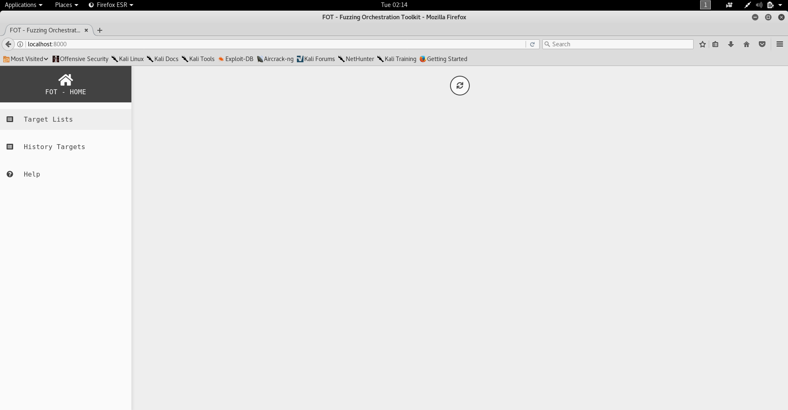

# CZ4062 Assignment
---

## Description 

```

In this fuzzing project, each team needs to select 2 programs from the list of programs to be tested 

Each of the 2 programs is to be fuzzed (tested) with FOT for 24 hours and these 2 programs are of a older version of GNU binutils.

During the testing, you will need to observe from the web UI, gather useful information such as the execution speed plots and put the observations into your report.
After 24 hours of fuzzing, FOT will find program inputs that can crash the target program, namely crashes.You will need to analyze the crashes and put the crash analysis into your report(the instructions of how to analyze the crashes will be provided later). 

Goal:

    Create a report containing the observations of the fuzzing process and the crash analysis.

    Create a zip file containing the inputs that can crash the 2 target programs found by FOT.

    Extract out as much information as possible and include in the report.

```
Docker Image is provided at this point of writing at [https://goo.gl/7c4Wm1](https://goo.gl/7c4Wm1).

---
## Setup

First, download the Kali image and boot it up with Virtual Machine. Guest addition is also being installed.

Secondly, Docker image was downloaded on a linux machine. In this case, I an using a Kali VM. In the link also, we are provided with some reference on basic linux commands, how to use the FOT Web UI and more information about the project. All these files will be stored in this folder.

Next, install the docker-ce for running the FOT container.

#### Docker-ce Installation

For the installation, make sure that there are no older version of docker being used. If yes, we will uninstall and then install the newest version of docker into the machine.

We can do it with a short bash script [setup.sh](setup.sh)

```bash

#! /usr/bin/bash
apt-get remove docker docker-engine docker.io
curl -fsSL https://download.docker.com/linux/debian/gpg | sudo apt-key add -
echo 'deb https://download.docker.com/linux/debian stretch stable' > /etc/apt/sources.list.d/docker.list
apt-get update
apt-get install docker-ce -y
systemctl start docker
```
You can also refer to this article at [medium](https://medium.com/@airman604/installing-docker-in-kali-linux-2017-1-fbaa4d1447fe).

After that, we can change file to executable and run it

```
root@kali:~# chmod +x setup.sh
root@kali:~# ./setup.sh
```

After installing docker and downloading the container for FOT, we can now start the fuzzing.

To check if docker is being installed.

```
root@kali:~/Desktop/comsecAssignment# docker --version
Docker version 18.09.0, build 4d60db4
```
---
## Fuzzing

After downloading the docker, we can now attempt to spin up the docker image

```
docker import 4062-fot-image.tar  
sha256:6da1b601f23b72743e8f72497deaf7baee43a1a3c6d48d7b561c1e8829172f71
```
Next we need to find the imageID to run. In this case, we can use the command

```
root@kali:~/Desktop/comsecAssignment# docker images
REPOSITORY          TAG                 IMAGE ID            CREATED             SIZE
<none>              <none>              6da1b601f23b        42 seconds ago      2.47GB
```

Next run, we use the run command

```
root@kali:~/Desktop/comsecAssignment# docker run --user docker -w /home/docker -it --privileged -p 8000:8000  6da1b601f23b /bin/bash
```

This runs docker as docker user and set its working directory to /home/docker and finally executing the command /bin/bash since running it on my machine gives an error.

You should get a bash shell by now

```
root@kali:~# docker run --user docker -w /home/docker  --privileged  -it  -p 8000:8000 6da1b601f23b /bin/bash
docker@aebcafc0de18:~$ whoami
docker
docker@aebcafc0de18:~$ sudo su
[sudo] password for docker: 
root@aebcafc0de18:/home/docker# whoami
root
root@aebcafc0de18:/home/docker# 
```

Password here by default is docker so we can get a root shell.

Now we can see that is a bootstrap.sh and start_ui.sh
We can first start a redis server 
```
root@aebcafc0de18:/home/docker# ./bootstrap.sh 
tee: 'cpu*/cpufreq/scaling_governor': No such file or directory
performance
Starting redis-server: redis-server.
```
And start the web ui 
```
./start_ui.sh
```

Now we can access the FOT web ui by typing 
```
http://localhost:8000
```
onto the web browser and you will be able to view it.


Under this directory, there are seven program that can be tested. For this assignment, testing two is enough.

```
docker@965238b4a553:~$ ls
bootstrap.sh  small_exec.elf    test-mjs-fot      test-readelf-fot
build-fot     start_ui.sh       test-nm-new-fot   test-strings-fot
fot-ui        test-cxxfilt-fot  test-objdump-fot  test-xed-fot
```

We will be testing strings and xed.

Starting with strings, we change to the test-strings-fot directory

```
docker@965238b4a553:~/test-strings-fot$ ls
Config.toml  in  log  start_test.sh  strings
docker@965238b4a553:~/test-strings-fot$
```

We can fun start_test.sh which clears any log folder at the beginning and run fot-fuzz comand with the prewritten configuration file.

Starting the fuzzing, we can use the command
```
docker@965238b4a553:~/test-strings-fot$ ./start_test.sh 
```
We will be fuzzing for 24 hours for each tests.

To stop the fuzzing , we can simply just hot on Ctrl-C
---

One thing that I found out, we are running 32 bits on 64 bits. This means that we need to add the architecture to support 32 bits. With a script, we can add the architecture.

```
#! /bin/bash

sudo dpkg --add-architecture i386
sudo apt-get update
sudo apt-get install lib32z1 libselinux1:i386 g++-multilib libc6-dev-i386
```

I am currently using peda GDB. To install peda GDB, run these

```
git clone https://github.com/longld/peda.git ~/peda
echo "source ~/peda/peda.py" >> ~/.gdbinit
echo "DONE! debug your program with gdb and enjoy"
```
---

## Analysis Of Crash

FOT will put crashes (input that can crash the target program) into folder with name like out_XXXX/crash.

After fuzzing, I can view the crash under out_20181120_07_27_46 directory.

I have also done this on docker shell 
```
sudo apt-get install zip
zip output.zip out_20181120_07_27_46 -r
python -m SimpleHTTPServer 1234
```

and received the files from docker with
```
wget 172.17.0.1:1234/output.zip
unzip output.zip
```

since I am new to docker and it resets itself everytime we exit the shell.


We can use gdb to analyze crash. For this project, I will send the folder over to my own linux host machine and and analyze it with peda gdb. To install peda GDB, we can type these into the command line.

Link to tutorial on GDB is given as well : [https://www.cs.umd.edu/~srhuang/teaching/cmsc212/gdb-tutorial-handout.pdf](https://www.cs.umd.edu/~srhuang/teaching/cmsc212/gdb-tutorial-handout.pdf)

After that respawn a new bash shell and gdb should have a different appearance with disassembly-flavor set to intel instead of the default AT&T.


---


## Crash Analysis has been done so far 

-	[analysis/1_strings_crash_w01_000010.md](analysis/1_strings_crash_w01_000010.md)
-	[analysis/2_strings_crash_w01_000119.md](2_strings_crash_w01_000119.md)

---
