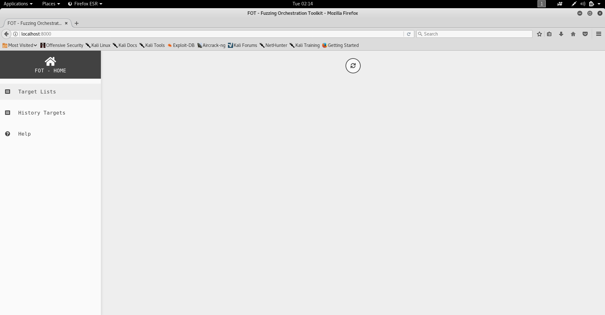
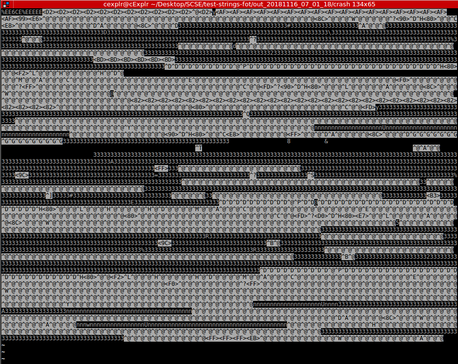
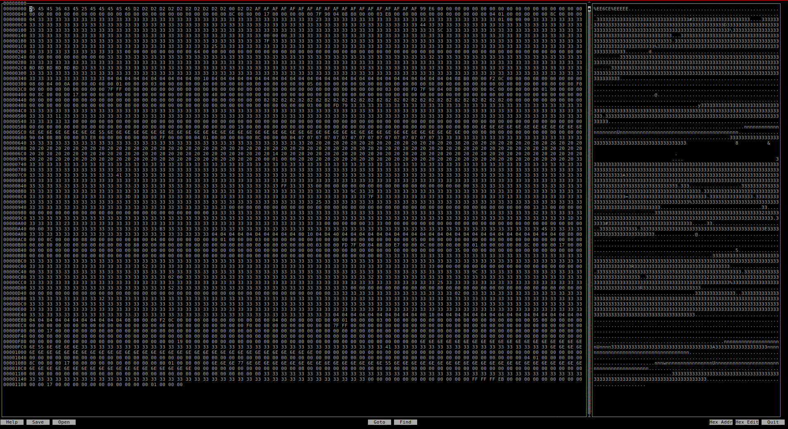

# CZ4062 Assignment
---

## Description 

```

In this fuzzing project, each team needs to select 2 programs from the list of programs to be tested 

Each of the 2 programs is to be fuzzed (tested) with FOT for 24 hours and these 2 programs are of a older version of GNU binutils.

During the testing, you will need to observe from the web UI, gather useful information such as the execution speed plots and put the observations into your report.
After 24 hours of fuzzing, FOT will find program inputs that can crash the target program, namely crashes.You will need to analyze the crashes and put the crash analysis into your report(the instructions of how to analyze the crashes will be provided later). 

Goal:

    Create a report containing the observations of the fuzzing process and the crash analysis.

    Create a zip file containing the inputs that can crash the 2 target programs found by FOT.

    Extract out as much information as possible and include in the report.

```
Docker Image is provided at this point of writing at [https://goo.gl/7c4Wm1](https://goo.gl/7c4Wm1).

---
## Setup

First, download the Kali image and boot it up with Virtual Machine. Guest addition is also being installed.

Secondly, Docker image was downloaded on a linux machine. In this case, I an using a Kali VM. In the link also, we are provided with some reference on basic linux commands, how to use the FOT Web UI and more information about the project. All these files will be stored in this folder.

Next, install the docker-ce for running the FOT container.

#### Docker-ce Installation

For the installation, make sure that there are no older version of docker being used. If yes, we will uninstall and then install the newest version of docker into the machine.

We can do it with a short bash script [setup.sh](setup.sh)

```bash

#! /usr/bin/bash
apt-get remove docker docker-engine docker.io
curl -fsSL https://download.docker.com/linux/debian/gpg | sudo apt-key add -
echo 'deb https://download.docker.com/linux/debian stretch stable' > /etc/apt/sources.list.d/docker.list
apt-get update
apt-get install docker-ce -y
systemctl start docker
```
You can also refer to this article at [medium](https://medium.com/@airman604/installing-docker-in-kali-linux-2017-1-fbaa4d1447fe).

After that, we can change file to executable and run it

```
root@kali:~# chmod +x setup.sh
root@kali:~# ./setup.sh
```

After installing docker and downloading the container for FOT, we can now start the fuzzing.

To check if docker is being installed.

```
root@kali:~/Desktop/comsecAssignment# docker --version
Docker version 18.09.0, build 4d60db4
```
---
## Fuzzing

After downloading the docker, we can now attempt to spin up the docker image

```
docker import 4062-fot-image.tar  
sha256:6da1b601f23b72743e8f72497deaf7baee43a1a3c6d48d7b561c1e8829172f71
```
Next we need to find the imageID to run. In this case, we can use the command

```
root@kali:~/Desktop/comsecAssignment# docker images
REPOSITORY          TAG                 IMAGE ID            CREATED             SIZE
<none>              <none>              6da1b601f23b        42 seconds ago      2.47GB
```

Next run, we use the run command

```
root@kali:~/Desktop/comsecAssignment# docker run --user docker -w /home/docker -it --privileged -p 8000:8000  6da1b601f23b /bin/bash
```

This runs docker as docker user and set its working directory to /home/docker and finally executing the command /bin/bash since running it on my machine gives an error.

You should get a bash shell by now

```
root@kali:~# docker run --user docker -w /home/docker  --privileged  -it  -p 8000:8000 6da1b601f23b /bin/bash
docker@aebcafc0de18:~$ whoami
docker
docker@aebcafc0de18:~$ sudo su
[sudo] password for docker: 
root@aebcafc0de18:/home/docker# whoami
root
root@aebcafc0de18:/home/docker# 
```

Password here by default is docker so we can get a root shell.

Now we can see that is a bootstrap.sh and start_ui.sh
We can first start a redis server 
```
root@aebcafc0de18:/home/docker# ./bootstrap.sh 
tee: 'cpu*/cpufreq/scaling_governor': No such file or directory
performance
Starting redis-server: redis-server.
```
And start the web ui 
```
./start_ui.sh
```

Now we can access the FOT web ui by typing 
```
http://localhost:8000
```
onto the web browser and you will be able to view it.


Under this directory, there are seven program that can be tested. For this assignment, testing two is enough.

```
docker@965238b4a553:~$ ls
bootstrap.sh  small_exec.elf    test-mjs-fot      test-readelf-fot
build-fot     start_ui.sh       test-nm-new-fot   test-strings-fot
fot-ui        test-cxxfilt-fot  test-objdump-fot  test-xed-fot
```

We will be testing strings and xed.

Starting with strings, we change to the test-strings-fot directory

```
docker@965238b4a553:~/test-strings-fot$ ls
Config.toml  in  log  start_test.sh  strings
docker@965238b4a553:~/test-strings-fot$
```

We can fun start_test.sh which clears any log folder at the beginning and run fot-fuzz comand with the prewritten configuration file.

Starting the fuzzing, we can use the command
```
docker@965238b4a553:~/test-strings-fot$ ./start_test.sh 
```
We will be fuzzing for 24 hours for each tests.

To stop the fuzzing , we can simply just hot on Ctrl-C
---

One thing that I found out, we are running 32 bits on 64 bits. This means that we need to add the architecture to support 32 bits. With a script, we can add the architecture.

```
#! /bin/bash

sudo dpkg --add-architecture i386
sudo apt-get update
sudo apt-get install lib32z1 libselinux1:i386 g++-multilib libc6-dev-i386
```

I am currently using peda GDB. To install peda GDB, run these

```
git clone https://github.com/longld/peda.git ~/peda
echo "source ~/peda/peda.py" >> ~/.gdbinit
echo "DONE! debug your program with gdb and enjoy"
```
---

## Analysis Of Crash

FOT will put crashes (input that can crash the target program) into folder with name like out_XXXX/crash.

After fuzzing, I can view the crash under out_20181120_07_27_46 directory.

I have also done this on docker shell 
```
sudo apt-get install zip
zip output.zip out_20181120_07_27_46 -r
python -m SimpleHTTPServer 1234
```

and received the files from docker with
```
wget 172.17.0.1:1234/output.zip
unzip output.zip
```

since I am new to docker and it resets itself everytime we exit the shell.


We can use gdb to analyze crash. For this project, I will send the folder over to my own linux host machine and and analyze it with peda gdb. To install peda GDB, we can type these into the command line.

Link to tutorial on GDB is given as well : [https://www.cs.umd.edu/~srhuang/teaching/cmsc212/gdb-tutorial-handout.pdf](https://www.cs.umd.edu/~srhuang/teaching/cmsc212/gdb-tutorial-handout.pdf)

After that respawn a new bash shell and gdb should have a different appearance with disassembly-flavor set to intel instead of the default AT&T.

We can choose about 5 crashes and attempt to analyze the reason for the crash. We will be using backtrace in gdb running the inputs for the crash.


## Case 1 - Malformed ELF

I tried to create a text.txt file with 

``` echo 'Hello World'>text.txt``` and used it as an argument of strings and it does print it out successfully before aborting.

``` 
cexplr@cExplr  ~/Desktop/test-strings-fot/out_20181120_12_17_11/crash  ../../strings text.txt     
Hello World
```

I then used strace command to see what system calls are being called.

```
 cexplr@cExplr  ~/Desktop/test-strings-fot/out_20181120_12_17_11/crash  strace ../../strings  text.txt
execve("../../strings", ["../../strings", "text.txt"], [/* 57 vars */]) = 0
brk(NULL)                               = 0x1174000
access("/etc/ld.so.nohwcap", F_OK)      = -1 ENOENT (No such file or directory)
access("/etc/ld.so.preload", R_OK)      = -1 ENOENT (No such file or directory)
open("/etc/ld.so.cache", O_RDONLY|O_CLOEXEC) = 3
fstat(3, {st_mode=S_IFREG|0644, st_size=140546, ...}) = 0
mmap(NULL, 140546, PROT_READ, MAP_PRIVATE, 3, 0) = 0x7fd4c198c000
close(3)                                = 0
access("/etc/ld.so.nohwcap", F_OK)      = -1 ENOENT (No such file or directory)
open("/lib/x86_64-linux-gnu/libc.so.6", O_RDONLY|O_CLOEXEC) = 3
read(3, "\177ELF\2\1\1\3\0\0\0\0\0\0\0\0\3\0>\0\1\0\0\0P\t\2\0\0\0\0\0"..., 832) = 832
fstat(3, {st_mode=S_IFREG|0755, st_size=1868984, ...}) = 0
mmap(NULL, 4096, PROT_READ|PROT_WRITE, MAP_PRIVATE|MAP_ANONYMOUS, -1, 0) = 0x7fd4c198b000
mmap(NULL, 3971488, PROT_READ|PROT_EXEC, MAP_PRIVATE|MAP_DENYWRITE, 3, 0) = 0x7fd4c13c0000
mprotect(0x7fd4c1580000, 2097152, PROT_NONE) = 0
mmap(0x7fd4c1780000, 24576, PROT_READ|PROT_WRITE, MAP_PRIVATE|MAP_FIXED|MAP_DENYWRITE, 3, 0x1c0000) = 0x7fd4c1780000
mmap(0x7fd4c1786000, 14752, PROT_READ|PROT_WRITE, MAP_PRIVATE|MAP_FIXED|MAP_ANONYMOUS, -1, 0) = 0x7fd4c1786000
close(3)                                = 0
mmap(NULL, 4096, PROT_READ|PROT_WRITE, MAP_PRIVATE|MAP_ANONYMOUS, -1, 0) = 0x7fd4c198a000
mmap(NULL, 4096, PROT_READ|PROT_WRITE, MAP_PRIVATE|MAP_ANONYMOUS, -1, 0) = 0x7fd4c1989000
arch_prctl(ARCH_SET_FS, 0x7fd4c198a700) = 0
mprotect(0x7fd4c1780000, 16384, PROT_READ) = 0
mprotect(0x6f6000, 4096, PROT_READ)     = 0
mprotect(0x7fd4c19af000, 4096, PROT_READ) = 0
munmap(0x7fd4c198c000, 140546)          = 0
write(199, "\232\2\0\0", 4)             = -1 EBADF (Bad file descriptor)
brk(NULL)                               = 0x1174000
brk(0x1195000)                          = 0x1195000
open("/usr/lib/locale/locale-archive", O_RDONLY|O_CLOEXEC) = 3
fstat(3, {st_mode=S_IFREG|0644, st_size=2981280, ...}) = 0
mmap(NULL, 2981280, PROT_READ, MAP_PRIVATE, 3, 0) = 0x7fd4c10e8000
close(3)                                = 0
open("/usr/lib/x86_64-linux-gnu/gconv/gconv-modules.cache", O_RDONLY) = 3
fstat(3, {st_mode=S_IFREG|0644, st_size=26258, ...}) = 0
mmap(NULL, 26258, PROT_READ, MAP_SHARED, 3, 0) = 0x7fd4c19a8000
close(3)                                = 0
stat("text.txt", {st_mode=S_IFREG|0664, st_size=12, ...}) = 0
open("text.txt", O_RDONLY)              = 3
fstat(3, {st_mode=S_IFREG|0664, st_size=12, ...}) = 0
read(3, "Hello World\n", 4096)          = 12
read(3, "", 4096)                       = 0
lseek(3, 0, SEEK_SET)                   = 0
read(3, "Hello World\n", 4096)          = 12
read(3, "", 4096)                       = 0
lseek(3, 0, SEEK_SET)                   = 0
read(3, "Hello World\n", 4096)          = 12
read(3, "", 4096)                       = 0
lseek(3, 0, SEEK_SET)                   = 0
read(3, "Hello World\n", 4096)          = 12
lseek(3, 12, SEEK_SET)                  = 12
read(3, "", 4096)                       = 0
lseek(3, 0, SEEK_SET)                   = 0
read(3, "Hello World\n", 4096)          = 12
read(3, "", 4096)                       = 0
lseek(3, 0, SEEK_SET)                   = 0
read(3, "Hello World\n", 4096)          = 12
read(3, "", 4096)                       = 0
lseek(3, 0, SEEK_SET)                   = 0
read(3, "Hello World\n", 4096)          = 12
read(3, "", 4096)                       = 0
lseek(3, 0, SEEK_SET)                   = 0
read(3, "Hello World\n", 4096)          = 12
read(3, "", 4096)                       = 0
lseek(3, 0, SEEK_SET)                   = 0
read(3, "Hello World\n", 4096)          = 12
lseek(3, 12, SEEK_SET)                  = 12
lseek(3, 12, SEEK_SET)                  = 12
lseek(3, 12, SEEK_SET)                  = 12
close(3)                                = 0
open("text.txt", O_RDONLY)              = 3
fstat(3, {st_mode=S_IFREG|0664, st_size=12, ...}) = 0
read(3, "Hello World\n", 4096)          = 12
fstat(1, {st_mode=S_IFCHR|0620, st_rdev=makedev(136, 0), ...}) = 0
write(1, "Hello World\n", 12Hello World
)           = 12
read(3, "", 4096)                       = 0
close(3)                                = 0
exit_group(0)                           = ?
+++ exited with 0 +++

```

I have also tried it with a binary file since challenges in CTF challenges requires just a string command to find an easy flag. I tried to string the string binary also and there were no errors.

On the contrary, we have the input `w01_000014,sig:11,Havoc:1770:18304,src:w00_000000` under the crash directory. This apparently is a file.

```
docker@fffb77539f24:~/test-strings-fot$ file  out_20181121_04_03_22/crash/w01_000010\,sig\:11\,Havoc\:1936\:18304\,src\:w00_000000 
out_20181121_04_03_22/crash/w01_000010,sig:11,Havoc:1936:18304,src:w00_000000: ERROR: ELF 32-bit LSB executable, SPARC32PLUS, total store ordering, (SYSV) error reading (Invalid argument)
```

Turns out a file was generated with errors and that it is a 32 bit one.


Let first run this program against this input file.
```
docker@fffb77539f24:~/test-strings-fot$ ./strings out_20181121_04_03_22/crash/w01_000010\,sig\:11\,Havoc\:1936\:18304\,src\:w00_000000 
Segmentation fault (core dumped)
```
Here there is proof of a crash. SIGSEGV here usually mean that the program is trying to access memory that is not intended and is protected against.

Let's try to disassemble the binary file. Before that, let file it

```
docker@fffb77539f24:~/test-strings-fot$ file strings 
strings: ELF 64-bit LSB executable, x86-64, version 1 (SYSV), dynamically linked, interpreter /lib64/ld-linux-x86-64.so.2, for GNU/Linux 2.6.32, not stripped
```

Here the program is an ELF type file executable, 64 bits and dynamically linked with external libraries and also all the debugging symbols are not stripped away meaning that disassembling with GDB will be pleasant.

With that in mind, we can go on with GDB analysis.

We first fire up GDB and set file as strings then run it with the input file

```
(gdb) file strings
Reading symbols from strings...done.

(gdb) r out_20181121_04_03_22/crash/w01_000010,sig:11,Havoc:1936:18304,src:w00_000000 
Starting program: /home/docker/test-strings-fot/strings out_20181121_04_03_22/crash/w01_000010,sig:11,Havoc:1936:18304,src:w00_000000

Program received signal SIGSEGV, Segmentation fault.
0x000000000040f8ee in bfd_hash_lookup (table=0x71c0f0, string=0x0, create=1, copy=0) at ../../bfd/hash.c:374
374	../../bfd/hash.c: No such file or directory.
(gdb) 
```

There seem to be a fault and a No such file or directory is being message is being printed out. 

Let's attempt a backtrace by typing `where` or `backtrace` or `bt` in short.

```
gdb-peda$ where
#0  0x0000000000431c39 in bfd_section_from_shdr (abfd=0x71e180, shindex=0x3) at ../../bfd/elf.c:1657
#1  0x0000000000477dbb in bfd_elf32_object_p (abfd=0x71e180) at ../../bfd/elfcode.h:689
#2  0x0000000000408d91 in bfd_check_format_matches (abfd=0x71e180, format=<optimized out>, matching=0x0) at ../../bfd/format.c:228
#3  0x000000000040298f in strings_object_file (file=<optimized out>) at ../../binutils/strings.c:350
#4  strings_file (file=<optimized out>) at ../../binutils/strings.c:380
#5  main (argc=argc@entry=0x2, argv=argv@entry=0x7fffffffdde8) at ../../binutils/strings.c:298
#6  0x00007ffff7a2d830 in __libc_start_main (main=0x402020 <main>, argc=0x2, argv=0x7fffffffdde8, init=<optimized out>, 
    fini=<optimized out>, rtld_fini=<optimized out>, stack_end=0x7fffffffddd8) at ../csu/libc-start.c:291
#7  0x0000000000401f49 in _start ()
```
 Here in frame #1, we see that there is an error with bfd_section_from_shdr. BFD is a utility that has muliple purposes. It includes:
 
    -  Identifying executables and core files
      + Identify variety of file types
    -  Access to sections of files
      + Parses file header to determine names, virtual addresses, sizes, etc
    -  Specialized core file supports
    -  Locating the symbol information
      
      + Helps determine where to find symbopl information  

  For more information about Binary File Descriptors, checkout [https://docs.freebsd.org/info/gdbint/gdbint.info.BFD_support_for_GDB.html](https://docs.freebsd.org/info/gdbint/gdbint.info.BFD_support_for_GDB.html)

and [https://www.slac.stanford.edu/comp/unix/package/rtems/doc/html/bfd/bfd.info.BFD_front_end.html](https://www.slac.stanford.edu/comp/unix/package/rtems/doc/html/bfd/bfd.info.BFD_front_end.html)

One thing to note is that the lower the number of frame number, the more recent the execution. With BFD trying to determine the number of section headers which is counted by index. Naturally, this also mean that the string table index must not exceed the total size. This makes sense because accessing item outside an array will cause unintended and even unauthorized accessing of memory. 

Example:

```c
int arr1[3]={0,0,0};
int x = arr1[3];  //ERROR!!
```

Since the program gives a segfault, we can most likely determine that NX bit is set to protect the binary.

To check, we use the command checksec

```
 cexplr@cExplr  ~/Desktop/test-strings-fot  checksec ./strings                                           
[*] '/home/cexplr/Desktop/SCSE/test-strings-fot/strings'
    Arch:     amd64-64-little
    RELRO:    Partial RELRO
    Stack:    Canary found
    NX:       NX enabled
    PIE:      No PIE (0x400000)
```

Indeed NX bit is set! 

Let's see what is happening at the header information of this ELF file.

Also, we can see that the file is corrupted.
```
 cexplr@cExplr ~/Desktop/test-strings-fot  readelf -h  out_20181116_07_01_18/crash/w01_000010,sig:11,Havoc:956:18304,src:w00_000000

ELF Header:
  Magic:   7f 45 4c 46 01 01 01 00 00 00 00 00 00 00 00 1e 
  Class:                             ELF32
  Data:                              2's complement, little endian
  Version:                           1 (current)
  OS/ABI:                            UNIX - System V
  ABI Version:                       0
  Type:                              EXEC (Executable file)
  Machine:                           Intel 80386
  Version:                           0x1
  Entry point address:               0x8048074
  Start of program headers:          52 (bytes into file)
  Start of section headers:          164 (bytes into file)
  Flags:                             0x0
  Size of this header:               52 (bytes)
  Size of program headers:           32 (bytes)
  Number of program headers:         2
  Size of section headers:           40 (bytes)
  Number of section headers:         2      # INDEX MUST NEVER EXCEED THIS!!!!
  Section header string table index: 3 <corrupt: out of range>  # CULPRIT IS HERE
```

This proves that the file is malformed and thus gives trouble to the strings program in determining the file type. This is most likely due to the fact that there is no error checking to make sure that section header table index is smaller than the total number of section headers.

I have found similar troubles and that version of strings has since been patched.
It can be found here
[https://sourceware.org/bugzilla/attachment.cgi?id=10814&action=diff](https://sourceware.org/bugzilla/attachment.cgi?id=10814&action=diff).

Thus this error is caused by strings program trying to determine the type of file which leads to it trying to access memory outside of the intended space. Since header of ELF is used to determine the structure of the ELF file, section header string table index outside of range misleads strings into thinking that the file provided is correct and thus offsets the rest of the file inappropriately.

This also suggests that we can falsely flip some bits in the header and it may cause memory access violation.

#### Input : Malformed ELF file

Tried the files we have collected so far on the current version of strings and thankfully and sadly (grade wise), we were not able to reproduce the results. We did with a script.

```
for i in *;do strings $i; if [[ $(strings $i) == *"Seg"* ]]; then echo "OHHHHSHIT"; sleep 5; fi; done
```

and to check if their exit code is not zero

```
for i in *; do ../../strings $i; if ! [[ $? == "0" ]]; then echo "SOMETHING IS WRONG HERE";sleep 0.9 ;fi; done
```
---

## Crash 2 - [ Malformed Tek Hex file ]

Since it is our choice to choose any crash inputs, I wrote us a short line to view all the types of files. Interestingly, I found some that doesnt look like a file. So lets choose that for our next crash analysis.

```
for i in *; do file $i; sleep 0.5;done
```

and we see

```
.
.
.w01_000113,sig:11,Splice:5:16,src:w01_000877: ELF 32-bit LSB executable, Intel 80386, version 1 (SYSV), statically linked, corrupted section header size
w01_000114,sig:11,Havoc:560:1536,src:w01_000890: ELF 64-bit LSB processor-specific, *unknown arch 0xf9ff* (SYSV)
w01_000115,sig:11,Havoc:18945:24576,src:w01_000890: ELF 64-bit LSB processor-specific, *unknown arch 0xf9ff* (SYSV)
w01_000116,sig:11,Splice:1:24,src:w01_000913: data
w01_000117,sig:11,Havoc:6:736,src:w01_000924: data
w01_000118,sig:11,Havoc:7:736,src:w01_000924: data
w01_000119,sig:11,Havoc:58:5888,src:w01_000924: data
w01_000120,sig:11,Havoc:246:23552,src:w01_000924: data
.
.
.
```
For this lets take a look at data files. I choose `w01_000119,sig:11,Havoc:58:5888,src:w01_000924: data`.
Since this is a data file, we can take a at its content. 



Viewing it on a hex editor should be better.



There seem to contain a lot of repeating characters. It is also certainly not an ELF file because the ELF magic numbers are not present at the first few bytes of the file.

Now we try running as input for strings program.

```
cexplr@cExplr ~/Desktop/test-strings-fot/out_20181116_07_01_18/crash $ ../../strings w01_000119\,sig\:11\,Havoc\:58\:5888\,src\:w01_000924 
Segmentation fault
```

Just a lonely Segmentation Fault is printed out. 

Running it with GDB the same way, we get this

```
[----------------------------------registers-----------------------------------]
RAX: 0x3e9d 
RBX: 0x63 ('c')
RCX: 0x70bae0 --> 0x0 
RDX: 0x70bae0 --> 0x0 
RSI: 0x64 ('d')
RDI: 0x3333333333333333 ('33333333')
RBP: 0x7fffffffda3d ('3' <repeats 20 times>, "\001")
RSP: 0x7fffffffd940 --> 0xcd65 
RIP: 0x40bfd7 (<bfd_alloc+39>:	mov    rdi,QWORD PTR [rdi+0x118])
R8 : 0x3 
R9 : 0x63 ('c')
R10: 0x3333333333333352 ('R3333333')
R11: 0x7ffff7b5aea0 (<__memcpy_avx_unaligned>:	mov    rax,rdi)
R12: 0xfffffffffffffffc 
R13: 0x64 ('d')
R14: 0xfffffffffffffffc 
R15: 0x7fffffffda3b ("3#", '3' <repeats 20 times>, "\001")
EFLAGS: 0x10206 (carry PARITY adjust zero sign trap INTERRUPT direction overflow)
[-------------------------------------code-------------------------------------]
   0x40bfc6 <bfd_alloc+22>:	xor    rax,0x48de
   0x40bfcc <bfd_alloc+28>:	inc    BYTE PTR [rcx+rax*1]
   0x40bfcf <bfd_alloc+31>:	mov    DWORD PTR fs:[r14],0x246f
=> 0x40bfd7 <bfd_alloc+39>:	mov    rdi,QWORD PTR [rdi+0x118]
   0x40bfde <bfd_alloc+46>:	lea    rax,[rsi+0x7]
   0x40bfe2 <bfd_alloc+50>:	and    rax,0xfffffffffffffff8
   0x40bfe6 <bfd_alloc+54>:	test   rsi,rsi
   0x40bfe9 <bfd_alloc+57>:	mov    esi,0x8
[------------------------------------stack-------------------------------------]
0000| 0x7fffffffd940 --> 0xcd65 
0008| 0x7fffffffd948 --> 0x63 ('c')
0016| 0x7fffffffd950 --> 0x71e740 --> 0x71e180 --> 0x0 
0024| 0x7fffffffd958 --> 0x416405 (<tekhex_object_p+4165>:	mov    QWORD PTR [r14+0x8],rax)
0032| 0x7fffffffd960 --> 0x0 
0040| 0x7fffffffd968 --> 0x3645452533000000 ('')
0048| 0x7fffffffd970 ('3' <repeats 20 times>, "\001")
0056| 0x7fffffffd978 ('3' <repeats 12 times>, "\001")
[------------------------------------------------------------------------------]
Legend: code, data, rodata, value
Stopped reason: SIGSEGV
bfd_alloc (abfd=0x3333333333333333, size=0x64) at ../../bfd/opncls.c:652
652	../../bfd/opncls.c: No such file or directory.
gdb-peda$ 

```

Here we have an error at btf_alloc which is essentially used to allocate a block of WANTED bytes of memory attached to `abfd' and
return a pointer to it. 
```
 void *bfd_alloc (bfd *abfd, bfd_size_type wanted);
 ```
Refer to [https://www.slac.stanford.edu/comp/unix/package/rtems/doc/html/bfd/bfd.info.Opening_and_Closing.html](https://www.slac.stanford.edu/comp/unix/package/rtems/doc/html/bfd/bfd.info.Opening_and_Closing.html) for more information on this function.

Opening the backtrace,

```
gdb-peda$ where
#0  bfd_alloc (abfd=0x3333333333333333, size=0x64) at ../../bfd/opncls.c:652
#1  0x0000000000416405 in first_phase (abfd=<optimized out>, type=<optimized out>, src=<optimized out>) at ../../bfd/tekhex.c:458
#2  pass_over (abfd=<optimized out>, func=<optimized out>) at ../../bfd/tekhex.c:519
#3  tekhex_object_p (abfd=<optimized out>) at ../../bfd/tekhex.c:588
#4  0x0000000000408d91 in bfd_check_format_matches (abfd=0x71e180, format=<optimized out>, matching=0x0) at ../../bfd/format.c:228
#5  0x000000000040298f in strings_object_file (file=<optimized out>) at ../../binutils/strings.c:350
#6  strings_file (file=<optimized out>) at ../../binutils/strings.c:380
#7  main (argc=argc@entry=0x2, argv=argv@entry=0x7fffffffdc78) at ../../binutils/strings.c:298
#8  0x00007ffff7a2d830 in __libc_start_main (main=0x402020 <main>, argc=0x2, argv=0x7fffffffdc78, init=<optimized out>, fini=<optimized out>, rtld_fini=<optimized out>, stack_end=0x7fffffffdc68) at ../csu/libc-start.c:291
#9  0x0000000000401f49 in _start ()
```
The bfd_alloc is getting an invalid memory location for the abdf. This again mean that an attempting to access protected memory location that this program does not have the permission to access.

After some reading up, strings made use of BFD to check for files and the functions used inside can be read from
[https://www.slac.stanford.edu/comp/unix/package/rtems/doc/html/bfd/bfd.info.BFD_front_end.html](https://www.slac.stanford.edu/comp/unix/package/rtems/doc/html/bfd/bfd.info.BFD_front_end.html).

I have no clue what is happening so I stepped through a file that does not crash the strings program and attempt to see what the flow of the program is like. Note that this is only my interpretation of the strings program.

It crashes as it is trying to determine the format of the file with 

```
bfd_boolean bfd_check_format (bfd *abfd, bfd_format format);
```

What this function does is BFD will try to determine the format of the file and if target format is determined in the parameter then the format will be checked against and return false with error code, else it will interrogate against all known formats in its BFD backend.
To read up more about bfd_check_format, check out [https://www.slac.stanford.edu/comp/unix/package/rtems/doc/html/bfd/bfd.info.Formats.html](https://www.slac.stanford.edu/comp/unix/package/rtems/doc/html/bfd/bfd.info.Formats.html).
and [http://www.cypress.com/file/74296/download](http://www.cypress.com/file/74296/download).

While it is trying to determine if the file is of format Tektronix extended Hex - `tekhex` (Tek Hex records can hold symbols and data, but not
	relocations. Their main application is communication with
	devices like PROM programmers and ICE equipment.
). For more information, go to [https://github.com/CyberGrandChallenge/binutils/blob/master/bfd/tekhex.c](https://github.com/CyberGrandChallenge/binutils/blob/master/bfd/tekhex.c). The reason that this might have been determine as texhex file is because each line of tek hex file starts with a percentage (%) sign and each line, according to [wikipedia](https://en.wikipedia.org/wiki/Tektronix_extended_HEX), consists of 

- Record Length ( 2 characters )
- Type (1 character)
- Checksum ( 1 byte )
- Address ( 9 characters with first byte always 8 [address size] )
- Data ( Contains executable code and other data )

With these in mind, I got curious and so created a crafted file to simulate this

```
echo "%3F60E41008FFFFFFFFFFFFFFFF" >  crash.hex
```

This results in a bug reporting message.

```
 cexplr@cExplr ~/Desktop/test-strings-fot ./strings crash.hex        
  SIGSEGV(11) 

BFD: BFD 2.15 internal error, aborting at ../../bfd/tekhex.c line 516 in void pass_over()

BFD: Please report this bug.

```
Which is not what is expected but Ive found a bug from this accidentally.
`%3F60E41008FFFFFFFFFFFFFFFF` here is crafted somce `%` is the start of a tekhex file and 3F is exaggerated since this is the length of the file which is obviously not the case. Next its a legitimite input of 6 which represents data records. The next two bytes is a randomly placed checksum which is wrong and the rest are the records. This manages to trick this version of strings to think it is a tekhex file and also causes to have many difficulties understanding the format. 

There were some allocation of memory going on in the crash input as we can see in frame #0 of the backtrace.

```
#0  bfd_alloc (abfd=0x3333333333333333, size=0x64) at ../../bfd/opncls.c:652
```
This has caused unauthorized access to memory since abfd is pointer pointing to an invalid 64 bit address/ This causes a segmentation fault and thus the crash. 

We can chec out also more of other formats from [http://www.idea2ic.com/File_Formats/Hexadecimal%20file%20formats.pdf](http://www.idea2ic.com/File_Formats/Hexadecimal%20file%20formats.pdf).


#### Input : Malformed TEKHEX file messing with the data records

Thus causing incorrect pointer input in bfd_alloc under bfd_check_format.

---

