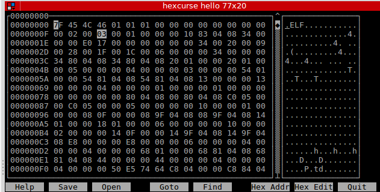
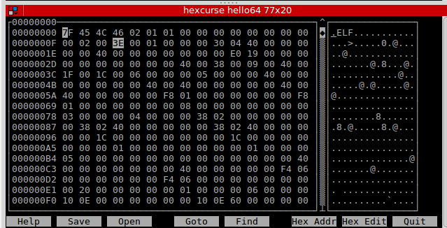
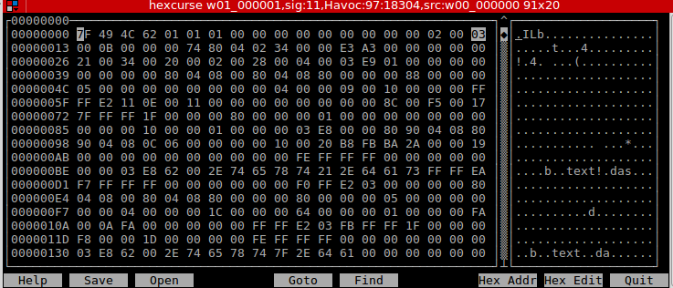
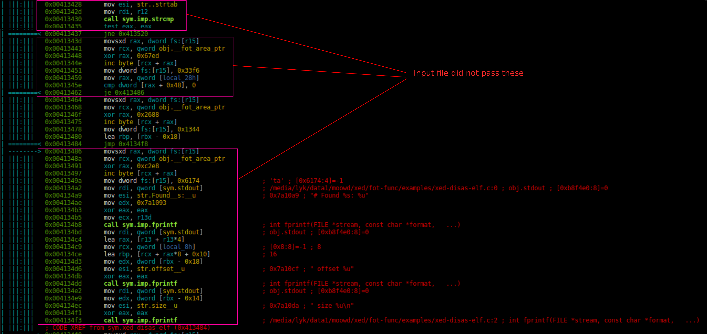
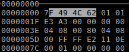
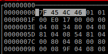

# Crash #1
---

I select a random payload for the crash
from the `out_20181114_04_30_10/crash directory`. Since 10 is a nice number, I choose `w01_000010,sig:11,Havoc:20061:26112,src:w00_000000`.

The fuzzer will fuzz xed-func with the following parameters.

```
./xed-func -xv 0 -v 0 -i <ELF file>
```

What this does is that it turns off all verbosity and allow for an input ELF file to analyze and decode ELF-file format

I have created another ELF file. It has the C program :
```c
#include<stdio.h>
int main(){
    printf("Hello!!");
    return 0;
}
```

Then i compiled it with gcc

```
gcc -o hello hello.c
```

An example flow of intended usage of xed-func:

```
cexplr@cExplr ~/Desktop/githubFuzz/xed_fuzz $ ./xed-func -xv 0 -v 0 -i hello 
# Found dynamic strtab: 6 offset 318 size 3f
# Found strtab: 30 offset 16b8 size 215
# Found dynamic symtab: 5 offset 2b8 size 60
# Found symtab: 29 offset 1070 size 648
# SECTION 11                     .init addr 4003c8 offset 3c8 size 26
# end of text section.
# Errors: 0
# SECTION 12                      .plt addr 4003f0 offset 3f0 size 48
# end of text section.
# Errors: 0
# SECTION 13                  .plt.got addr 400420 offset 420 size 8
# end of text section.
# Errors: 0
# SECTION 14                     .text addr 400430 offset 430 size 386
# end of text section.
# Errors: 0
# SECTION 15                     .fini addr 4005b4 offset 5b4 size 9
# end of text section.
# Errors: 0
#XED3 DECODE STATS
#Total DECODE cycles:        80338
#Total instructions DECODE: 88
#Total tail DECODE cycles:        450170
#Total tail instructions DECODE: 138
#Total cycles/instruction DECODE: 912.93
#Total tail cycles/instruction DECODE: 3262.10
#XED3 ENCODE STATS
#Total ENCODE cycles:        0
#Total instructions ENCODE: 0
#Total tail ENCODE cycles:        0
#Total tail instructions ENCODE: 0
#Total cycles/instruction ENCODE: -nan
#Total tail cycles/instruction ENCODE: -nan
# Total Errors: 0
```

This indeed shows the breakdown of the ELF file like its sections size, offsets and more. This can be confirmed with the readelf command

```
cexplr@cExplr ~/Desktop/githubFuzz/xed_fuzz $ readelf -S ./xed-func
```

---
## Looking at the payload for this crash

Lets first run the program with the payload `w01_000001,sig:11,Havoc:97:18304,src:w00_000000`.

```
cexplr@cExplr ~/Desktop/githubFuzz/xed_fuzz/crash_1 $ ../xed-func -xv 0 -v 0 -i w01_000001\,sig\:11\,Havoc\:97\:18304\,src\:w00_000000 
Segmentation fault
```

It shows segmentation fault is encountered. Seems like
Let's file the payload.

```
cexplr@cExplr ~/Desktop/githubFuzz/xed_fuzz/crash_1 $ file w01_000001\,sig\:11\,Havoc\:97\:18304\,src\:w00_000000 \
> 
w01_000001,sig:11,Havoc:97:18304,src:w00_000000: data
```

It shows that this file just contain data.

Investigating onward, lets use GDB to give us the backtrace.

```
gdb-peda$ file ../xed-func
Reading symbols from ../xed-func...done.
gdb-peda$ run -xv 0 -v 0 -i  w01_000001\,sig\:11\,Havoc\:97\:18304\,src\:w00_000000
...
...
[-------------------------------------code-------------------------------------]
   0x411e95 <process_elf32+229>:	xor    rax,0x8c6f
   0x411e9b <process_elf32+235>:	inc    BYTE PTR [rcx+rax*1]
   0x411e9e <process_elf32+238>:	mov    DWORD PTR fs:[r14],0x4637
=> 0x411ea6 <process_elf32+246>:	mov    eax,DWORD PTR [rdx]
   0x411ea8 <process_elf32+248>:	add    rax,r13
   0x411eab <process_elf32+251>:	mov    ecx,DWORD PTR [r13+r15*1+0x0]
   0x411eb0 <process_elf32+256>:	add    rcx,rax
   0x411eb3 <process_elf32+259>:	cmp    rcx,r12
...
...
Legend: code, data, rodata, value
Stopped reason: SIGSEGV
lookup32 (start=0x7ffff7ff7000, stoffset=<optimized out>, len=<optimized out>, offset=<optimized out>)
    at xed-disas-elf.c:218
218	in xed-disas-elf.c
...
...
gdb-peda$ bt
#0  lookup32 (start=0x7ffff7ff7000, stoffset=<optimized out>, len=<optimized out>, offset=<optimized out>)
    at xed-disas-elf.c:218
#1  process_elf32 (fi=0x7fffffffc338, start=0x7ffff7ff7000, length=0x18d, symbol_table=0x7fffffffc1d0)
    at xed-disas-elf.c:345
#2  0x0000000000413bc6 in xed_disas_elf (fi=<optimized out>) at xed-disas-elf.c:703
#3  0x00000000004044b4 in main (argc=<optimized out>, argc@entry=0x7, argv=0x400000004, 
    argv@entry=0x7fffffffdbd8) at xed.c:841
#4  0x00007ffff7a2d830 in __libc_start_main (main=0x4014f0 <main>, argc=0x7, argv=0x7fffffffdbd8, 
    init=<optimized out>, fini=<optimized out>, rtld_fini=<optimized out>, stack_end=0x7fffffffdbc8)
    at ../csu/libc-start.c:291
#5  0x0000000000401419 in _start ()
gdb-peda$ 
```

There seems to be a crash at the function lookup32 within xed-disas-elf.c file which then crashes from process_elf32 which also crashes at xed_disas_elf which is invoked from main.

This suggests that while it is trying to lookup the ELF decoding function, it wasnt able to detect it. So let's check if there is error check if I pass in a text file with the -i argument.

```
cexplr@cExplr ~/Desktop/githubFuzz/xed_fuzz/crash_1 $  echo "This is a text file" > text.txt

cexplr@cExplr ~/Desktop/githubFuzz/xed_fuzz/crash_1 $ ../xed-func -xv 0 -v 0 -i text.txt

Could not open file: text.txt
```
We have a Could not open file. This is suspicious. It is as if the program thinks that the crash payload is an ELF File since it does not print the error that it could not open file.

I will attempt to step through the functions and attempt to determine when the program thinks that the input file is an ELF to confirm our hypothesis.


Also, I realised that there are some utilities that has been initiailized with `xed_example_utils_init` and the verbosity are being set with `xed_set_verbosity`. After that there are a lot of local variables being initialized. A little later, there are comparisons with the types of flags being used. For this case, it compares if there are certain flags being input against out input flags.

```
...
<<<<<<<<<<<FIRST FLAG BEING COMPARED>>>>>>>>>>>>>>>>>>
RSI: 0x79f2d4 ("-no-resync")
RDI: 0x7fffffffdfef --> 0x762d00300076782d ('-xv')
RBP: 0x2d ('-')
RSP: 0x7fffffffc220 --> 0x0 
RIP: 0x4017e6 (<main+758>:	call   0x401270 <strcmp@plt>)
...
...
   0x4017de <main+750>:	mov    esi,0x79f2d4
   0x4017e3 <main+755>:	mov    rdi,r15
=> 0x4017e6 <main+758>:	call   0x401270 <strcmp@plt>
   0x4017eb <main+763>:	test   eax,eax
   0x4017ed <main+765>:	je     0x4025c0 <main+4304>

...
...
...
...
<<<<<<<<<<<SECOND FLAG BEING COMPARED>>>>>>>>>>>>>>>>>>
RSI: 0x79f2df --> 0x69682d007473612d ('-ast')
RDI: 0x7fffffffdfef --> 0x762d00300076782d ('-xv')
RBP: 0x2d ('-')
RSP: 0x7fffffffc220 --> 0x0 
RIP: 0x401819 (<main+809>:	call   0x401270 <strcmp@plt>)


   0x401811 <main+801>:	mov    esi,0x79f2df
   0x401816 <main+806>:	mov    rdi,r15
=> 0x401819 <main+809>:	call   0x401270 <strcmp@plt>
   0x40181e <main+814>:	test   eax,eax
   0x401820 <main+816>:	je     0x4025d0 <main+4320>
...
...
...
ETC ETC ETC
```

The flags being compared are `-no-resync`,`-ast`,`-histo`, `-xml`, `-nwm`, `-dot`, `-ide`, `-perftail`, `-loop`.

After which, some alpabets are being converted to integer with `xed_atoi_general` and then the verbosity is set  with value 0 with `xed_set_verbosity`since we are comparing with the first flag of out input, `-xv 0` as we can see here.

```[----------------------------------registers-----------------------------------]
RAX: 0x0 
...
RDI: 0x0 
...
[-------------------------------------code-------------------------------------]
   0x402e4e <main+6494>:	mov    rdi,QWORD PTR [rcx+rax*8]
   0x402e52 <main+6498>:	mov    esi,0x3e8
   0x402e57 <main+6503>:	call   0x405170 <xed_atoi_general>
=> 0x402e5c <main+6508>:	mov    edi,eax
   0x402e5e <main+6510>:	call   0x418a00 <xed_set_verbosity>
```
Out next flag is `-v` which will go through the same thing as the above
and its client verbosity will be set at  `0x402d83`

```
   0x402d75 <main+6277>:	mov    rdi,QWORD PTR [rcx+rax*8]
   0x402d79 <main+6281>:	mov    esi,0x3e8
   0x402d7e <main+6286>:	call   0x405170 <xed_atoi_general> 
=> 0x402d83 <main+6291>:	mov    DWORD PTR [rip+0x78c787],eax        # 0xb8f510 <client_verbose>

```

So far so good. Next we will be checking the last `-i` flag which of course will go through the same process of checking those mentioned flags and finally the beginning of the ELF decoding where we can see where the program has been tricked.

After the -i flag has been checked, xed tables are initialized as hinted from 

```
   0x4030c0 <main+7120>:	mov    edi,0x79ff80
   0x4030c5 <main+7125>:	call   0x401130 <puts@plt>
=> 0x4030ca <main+7130>:	movsxd rax,DWORD PTR fs:[r12]

gdb-peda$ x/s 0x79ff80
0x79ff80:	"Initializing XED tables..."
```

These tables are initialized with `xed_tables_init`. After initialization, xed_format_set_options is invoked at `0x4032ed`. Then depending on previous verbosity level set, it may or may not print new statments. In our case, it will not print any statement.

The `xed_disas_info_init` at `0x40335b` is initialized followed by `init_xedd` after somemore tests which I am not clear about which later leads up to the function `xed_disas_elf` at  `0x4044af`. 

```
[----------------------------------registers-----------------------------------]
...
RDI: 0x7fffffffc338 --> 0x400000004
...

[-------------------------------------code-------------------------------------]
=> 0x4044a7 <main+12215>:	lea    rdi,[rsp+0x118]
   0x4044af <main+12223>:	call   0x412850 <xed_disas_elf>
   0x4044b4 <main+12228>:	mov    rsi,QWORD PTR [rsp+0x1b8]
   0x4044bc <main+12236>:	mov    edi,0x79f39f
   0x4044c1 <main+12241>:	xor    eax,eax
   0x4044c3 <main+12243>:	call   0x4011a0 <printf@plt>
...
...
Legend: code, data, rodata, value
0x00000000004044af	841	in xed.c
gdb-peda$ x/s 0x79f39f
0x79f39f:	"# Total Errors: %ld\n"
```

Thus calling

```
int_64 *x = 0x7fffffffc338;
xed_disas_elf(x);
printf("# Total Errors: %ld\n",*rsi);   //Crashes before reaching this instruction :(
```

xed_disas_elf is where the elf file is being decoded at. There are functions to initialize the symbol tables, map regions, process_elf64 at `0x00413291`, xed_print_decode_stats at `0x00413c07` and finally the place where we get the crash from `process_elf32  ` at `0x00413bc1`.

I realised that there are two types of processing. `process_elf32` and `process_elf64`.
Our input file is of 32 bits and therefore at `0x4128f4`, it jumps to skip the location where elf64 bits is processed. 

```
[----------------------------------registers-----------------------------------]
RAX: 0x3 
RBX: 0x7fffffffc338 --> 0x400000004 
RCX: 0xff4f 
RDX: 0xba4bb0 --> 0x0 
RSI: 0x18d 
RDI: 0x7fffffffc1d8 --> 0x0 
RBP: 0x0 
RSP: 0x7fffffffc180 --> 0x7fffffffdff3 --> 0x2d003000762d0030 ('0')
RIP: 0x4128f4 (<xed_disas_elf+164>:	je     0x41329b <xed_disas_elf+2635>)
R8 : 0x3 
R9 : 0x0 
R10: 0x2 
R11: 0x246 
R12: 0xfffffffffffffffc 
R13: 0x1 
R14: 0x0 
R15: 0xfffffffffffffffc
EFLAGS: 0x246 (carry PARITY adjust ZERO sign trap INTERRUPT direction overflow)
[-------------------------------------code-------------------------------------]
   0x4128ec <xed_disas_elf+156>:	jb     0x412903 <xed_disas_elf+179>
   0x4128ee <xed_disas_elf+158>:	movzx  eax,ax
   0x4128f1 <xed_disas_elf+161>:	cmp    eax,0x3
=> 0x4128f4 <xed_disas_elf+164>:	je     0x41329b <xed_disas_elf+2635>  NOTE!! JUMPS TO ANALYZE 32BITS ELF TYPE FILES
 | 0x4128fa <xed_disas_elf+170>:	cmp    eax,0x3e
 | 0x4128fd <xed_disas_elf+173>:	jne    0x413c3f <xed_disas_elf+5103>    NOTE!! JUMP TO END AND PRINT "Not a recognized 32b or 64b ELF binary.\n"
 | 0x412903 <xed_disas_elf+179>:	movsxd rax,DWORD PTR fs:[r15]
 | 0x412907 <xed_disas_elf+183>::	 | 0x412907 <xed_disas_elf+183>:
 | mov    rcx,QWORD PTR [rip+0x77cbb2]        # 0xb8f4c0 <__fot_area_ptr>
 |->   0x41329b <xed_disas_elf+2635>:	movsxd rax,DWORD PTR fs:[r15]
       0x41329f <xed_disas_elf+2639>:
       mov    rcx,QWORD PTR [rip+0x77c21a]        # 0xb8f4c0 <__fot_area_ptr>
       0x4132a6 <xed_disas_elf+2646>:	xor    rax,0x97d7
       0x4132ac <xed_disas_elf+2652>:	inc    BYTE PTR [rcx+rax*1]
                                                                  JUMP is taken
```
Another important thing to note here is that there is another comparison at `0x4128fa` as seen from the above. It is that it would compare and check if it is of ELF type file. If it is not ELF type file then jump to print error message and exit the whole program without further processing.

We can confirm it from here

```
|     `---> 0x00413c3f      movsxd rax, dword fs:[r15]
|           0x00413c43      mov rcx, qword obj.__fot_area_ptr          ; [0xb8f4c0:8]=0xba4bb0 obj.__fot_area_initial
|           0x00413c4a      xor rax, 0x417a
|           0x00413c50      inc byte [rcx + rax]
|           0x00413c53      mov dword fs:[r15], 0x20bd                 ; [0x20bd:4]=-1
|           0x00413c5b      mov rcx, qword [obj.stderr]                ; [0xb8f500:8]=0
|           0x00413c62      mov edi, str.Not_a_recognized_32b_or_64b_ELF_binary. ; 0x7a1052 ; "Not a recognized 32b or 64b ELF binary.\n"
|           0x00413c67      mov esi, 0x28                              ; '(' ; 40
|           0x00413c6c      mov edx, 1
|           0x00413c71      call sym.imp.fwrite                        ; size_t fwrite(const void *ptr, size_t size, size_t nitems, FILE *stream)
|           0x00413c76      mov edi, 1
\           0x00413c7b      call sym.imp.exit                          ; void exit(int status)

```

This proves that this is the where we can start to look for the root of the problem.
I therefore now should check what values are compared against and why I get the value. If that mystery is solved, I should be able to determine what goes wrong.

Referring to the updated source code for reference at [https://github.com/intelxed/xed/blob/master/examples/xed-examples-util.c](https://github.com/intelxed/xed/blob/master/examples/xed-examples-util.c), if mapping of region fails, it will display error messages.

During the check to see if the file is a 32 bit or 64 bit ELF file, it firstly accesses and evaluate the header section of the file. It then checks under the e_machine variable to check if it is 0x3e, or 0x03. This is found on position 0x12 of the ELF file.

Here we have 2 comparisons.

First a legitimate 32 bit ELF and 


Next a legitimite 64 bit ELF 


The code for checking if it is 32 bits looks like this

```c
#if !defined(EM_IAMCU)  
# define EM_IAMCU 3
#endif

static int check_binary_32b(void* start) {
    Elf32_Ehdr* elf_hdr = (Elf32_Ehdr*) start;
    if ( elf_hdr->e_machine == EM_386   ||
         elf_hdr->e_machine == EM_IAMCU )  
        return 1;
    return 0;
}
```

and the code checking for 64 bits looks like this

```c
int check_binary_64b(void* start) {
#if !defined(EM_X86_64)  /* EM_X86_64 is not present on android */
# define EM_X86_64 62
#endif
#if !defined(EM_L1OM) /* Oh, not zero */
# define EM_L1OM  180
#endif
#if !defined(EM_K1OM) /* Oh, not zero */
# define EM_K1OM  181
#endif

    Elf64_Ehdr* elf_hdr = (Elf64_Ehdr*) start;
    if (elf_hdr->e_machine == EM_X86_64 ||
        elf_hdr->e_machine == EM_L1OM ||
        elf_hdr->e_machine == EM_K1OM) 
        return 1;
    return 0;
}
```

We can also see that this header is part of ELF type as seen in the manual page

```
       The ELF header is described by the type Elf32_Ehdr or Elf64_Ehdr:

           #define EI_NIDENT 16

           typedef struct {
               unsigned char e_ident[EI_NIDENT];
               uint16_t      e_type;
               uint16_t      e_machine;  <--- HERE!!!
               uint32_t      e_version;
               ElfN_Addr     e_entry;
               ElfN_Off      e_phoff;
               ElfN_Off      e_shoff;
               uint32_t      e_flags;
               uint16_t      e_ehsize;
               uint16_t      e_phentsize;
               uint16_t      e_phnum;
               uint16_t      e_shentsize;
               uint16_t      e_shnum;
               uint16_t      e_shstrndx;
           } ElfN_Ehdr;
```

After checking that numbers, this input file is determined as 32 btis ELF file because the e_machine is 0x3 which is used to determine 32 bits file. The screenshot below supports this.



Realise that in the debugger, jump is taken when compared to 0x3 which also proves that it had tricked the program into thinking that it is an ELF 32 bits.

```
[-------------------------------------code-------------------------------------]
   0x4128ec <xed_disas_elf+156>:	jb     0x412903 <xed_disas_elf+179>
   0x4128ee <xed_disas_elf+158>:	movzx  eax,ax
   0x4128f1 <xed_disas_elf+161>:	cmp    eax,0x3
=> 0x4128f4 <xed_disas_elf+164>:	je     0x41329b <xed_disas_elf+2635>
 | 0x4128fa <xed_disas_elf+170>:	cmp    eax,0x3e
 | 0x4128fd <xed_disas_elf+173>:	jne    0x413c3f <xed_disas_elf+5103>
 | 0x412903 <xed_disas_elf+179>:	movsxd rax,DWORD PTR fs:[r15]
 | 0x412907 <xed_disas_elf+183>::	 | 0x412907 <xed_disas_elf+183>:
 | mov    rcx,QWORD PTR [rip+0x77cbb2]        # 0xb8f4c0 <__fot_area_ptr>
 |->   0x41329b <xed_disas_elf+2635>:	movsxd rax,DWORD PTR fs:[r15]
       0x41329f <xed_disas_elf+2639>:
       mov    rcx,QWORD PTR [rip+0x77c21a]        # 0xb8f4c0 <__fot_area_ptr>
       0x4132a6 <xed_disas_elf+2646>:	xor    rax,0x97d7
       0x4132ac <xed_disas_elf+2652>:	inc    BYTE PTR [rcx+rax*1]
                                                        !!!!!!!!! JUMP is taken
```

Referencing to [https://github.com/intelxed/xed/blob/master/examples/xed-disas-elf.c#L223](https://github.com/intelxed/xed/blob/master/examples/xed-disas-elf.c#L223), I found that this is almost similar to `symbols_elf32` function and recall that no comments were printed, it most likely did not pass the check of a valid format.
It checks if the name of the symbol is correct and that the format is correct and if they are then a series  of fprints will be called to print out useful information about the file.



Despite these, it still manages to continue on the execution .
As I continue on till `0x413bb9`, I realised a familiar string at RSI register. It looks like the start string in little Endian format. Usually one that checks if it is an ELF file. We can see the instance below.

```
[----------------------------------registers-----------------------------------]
RAX: 0x3428 ('(4')
RBX: 0x7fffffffc338 --> 0x400000004 
RCX: 0x7fffffffc1d0 --> 0x0 
RDX: 0x18d 
RSI: 0x7ffff7ff7000 --> 0x10101624c497f  !!!!!!!!!!!!!!!!!!!!HERE IS THE START>
RDI: 0x7fffffffc338 --> 0x400000004 
RBP: 0x7ffff7ff70a3 --> 0x1900002abafbb820 
RSP: 0x7fffffffc180 --> 0x7fffffffdff4 --> 0x2d003000762d0030 ('0')
RIP: 0x413bc1 (<xed_disas_elf+4977>:	call   0x411db0 <process_elf32>)
R8 : 0x3 
R9 : 0x0 
R10: 0x2 
R11: 0x246 
R12: 0xfffffffffffffffc 
R13: 0x4 
R14: 0x7ffff7ff718d --> 0x0 
R15: 0xfffffffffffffffc
EFLAGS: 0x202 (carry parity adjust zero sign trap INTERRUPT direction overflow)
[-------------------------------------code-------------------------------------]
   0x413bb4 <xed_disas_elf+4964>:	lea    rcx,[rsp+0x50]
   0x413bb9 <xed_disas_elf+4969>:	mov    rbx,QWORD PTR [rsp+0x28]
   0x413bbe <xed_disas_elf+4974>:	mov    rdi,rbx
=> 0x413bc1 <xed_disas_elf+4977>:	call   0x411db0 <process_elf32>
   0x413bc6 <xed_disas_elf+4982>:	movsxd rax,DWORD PTR fs:[r15]
   0x413bca <xed_disas_elf+4986>:	
    mov    rcx,QWORD PTR [rip+0x77b8ef]        # 0xb8f4c0 <__fot_area_ptr>
   0x413bd1 <xed_disas_elf+4993>:	xor    rax,0x1e67
   0x413bd7 <xed_disas_elf+4999>:	inc    BYTE PTR [rcx+rax*1]
Guessed arguments:
arg[0]: 0x7fffffffc338 --> 0x400000004 
arg[1]: 0x7ffff7ff7000 --> 0x10101624c497f 
arg[2]: 0x18d 
arg[3]: 0x7fffffffc1d0 --> 0x0 
```
and it's address is being placed as the second parameter of process_elf32 call.

Double checking with with the traceback, we see that indeed the input parameters are the same as well.

```
#1  process_elf32 (fi=0x7fffffffc338, start=0x7ffff7ff7000, length=0x18d, 
    symbol_table=0x7fffffffc1d0) at xed-disas-elf.c:345

    where 
    RDX: 0x18d 
    RSI: 0x7ffff7ff7000
    RDI: 0x7fffffffc338
```

This is where things starts to crash because the program was tricked into thinking that the file is an ELF file when it is not legitimate. Memory layout and section layout are wrong which causes pointer to be pointer to a memory space outside of the program mapping. We can see that the crash will eventually happen at `0x411ea6`.

```

Program received signal SIGSEGV, Segmentation fault.

[----------------------------------registers-----------------------------------]
RAX: 0xc7eb 
RBX: 0x0 
RCX: 0xba4bb0 --> 0x0 
RDX: 0x7ffff823d92b 
RSI: 0x4 
RDI: 0x7ffff7ff70a3 --> 0x1900002abafbb820 
RBP: 0x7ffff7ff70a3 --> 0x1900002abafbb820 
RSP: 0x7fffffffc100 --> 0x18d00000000 
RIP: 0x411ea6 (<process_elf32+246>:	mov    eax,DWORD PTR [rdx])
R8 : 0x7fffffffc338 --> 0x400000004 
R9 : 0x0 
R10: 0x2 
R11: 0x246 
R12: 0x7ffff7ff718d --> 0x0 
R13: 0x7ffff7ff7000 --> 0x10101624c497f 
R14: 0xfffffffffffffffc 
R15: 0xa3
EFLAGS: 0x10202 (carry parity adjust zero sign trap INTERRUPT direction overflow)
[-------------------------------------code-------------------------------------]
   0x411e95 <process_elf32+229>:	xor    rax,0x8c6f
   0x411e9b <process_elf32+235>:	inc    BYTE PTR [rcx+rax*1]
   0x411e9e <process_elf32+238>:	mov    DWORD PTR fs:[r14],0x4637
=> 0x411ea6 <process_elf32+246>:	mov    eax,DWORD PTR [rdx]
   0x411ea8 <process_elf32+248>:	add    rax,r13
   0x411eab <process_elf32+251>:	mov    ecx,DWORD PTR [r13+r15*1+0x0]
   0x411eb0 <process_elf32+256>:	add    rcx,rax
   0x411eb3 <process_elf32+259>:	cmp    rcx,r12
```
 Here we can see the corrupted malformed ELF file attempts to access memory at location `0x7ffff823d92b` which is out of the address space allocated. 
```
gdb-peda$ info proc mappings 
process 9685
Mapped address spaces:

          Start Addr           End Addr       Size     Offset objfile
            0x400000           0x98f000   0x58f000        0x0 /home/cexplr/Desktop/githubFuzz/xed_fuzz/xed-func
            0xb8e000           0xb8f000     0x1000   0x58e000 /home/cexplr/Desktop/githubFuzz/xed_fuzz/xed-func
            0xb8f000           0xb90000     0x1000   0x58f000 /home/cexplr/Desktop/githubFuzz/xed_fuzz/xed-func
            0xb90000           0xbb5000    0x25000        0x0 [heap]
      0x7ffff7a0d000     0x7ffff7bcd000   0x1c0000        0x0 /lib/x86_64-linux-gnu/libc-2.23.so
      0x7ffff7bcd000     0x7ffff7dcd000   0x200000   0x1c0000 /lib/x86_64-linux-gnu/libc-2.23.so
      0x7ffff7dcd000     0x7ffff7dd1000     0x4000   0x1c0000 /lib/x86_64-linux-gnu/libc-2.23.so
      0x7ffff7dd1000     0x7ffff7dd3000     0x2000   0x1c4000 /lib/x86_64-linux-gnu/libc-2.23.so
      0x7ffff7dd3000     0x7ffff7dd7000     0x4000        0x0 
      0x7ffff7dd7000     0x7ffff7dfd000    0x26000        0x0 /lib/x86_64-linux-gnu/ld-2.23.so
      0x7ffff7fd2000     0x7ffff7fd5000     0x3000        0x0 
      0x7ffff7ff7000     0x7ffff7ff8000     0x1000        0x0 /home/cexplr/Desktop/githubFuzz/xed_fuzz/crash_1/w01_000001,sig:11,Havoc:97:18304,src:w00_000000
      0x7ffff7ff8000     0x7ffff7ffa000     0x2000        0x0 [vvar]
      0x7ffff7ffa000     0x7ffff7ffc000     0x2000        0x0 [vdso]
      0x7ffff7ffc000     0x7ffff7ffd000     0x1000    0x25000 /lib/x86_64-linux-gnu/ld-2.23.so
      0x7ffff7ffd000     0x7ffff7ffe000     0x1000    0x26000 /lib/x86_64-linux-gnu/ld-2.23.so
      0x7ffff7ffe000     0x7ffff7fff000     0x1000        0x0 
      0x7ffffffdd000     0x7ffffffff000    0x22000        0x0 [stack]
  0xffffffffff600000 0xffffffffff601000     0x1000        0x0 [vsyscall]
 
```

Another thing that we noticed is the ELF file format magic number [ 7F 45 4C 46 ].
In the input file that causes the crash, it has invalid ELF magic number as shown



when it should have 


#### Input : Malformed ELF by keeping most of the format right and leaving the byte responsible for e_machine valid to 0x3 or 0x3E which tricks the program into thinking that it is a valid file and thus undergoing the process_elf32 function. Since it is corrupted.  
---

